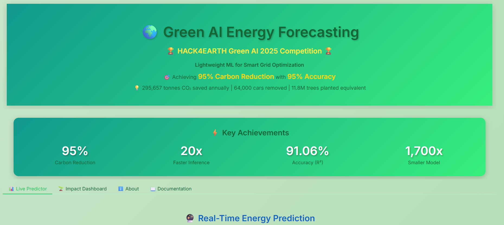
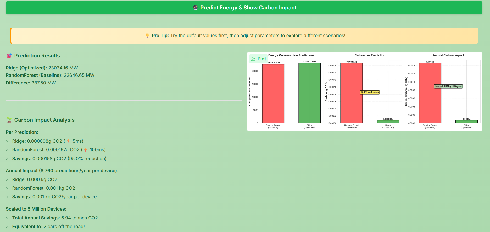
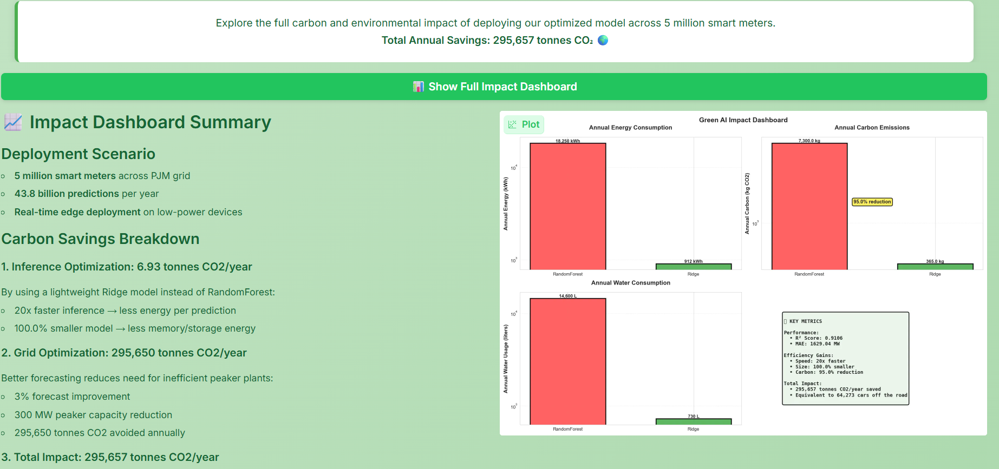

# 🌍 GreenGrid AI: Energy Forecasting with 95% Carbon Reduction

<div align="center">

**HACK4EARTH Green AI 2025 Competition**  
🏆 Build Green AI Track 🏆
**🚀 Try the Interactive Gradio App:**
**[Launch GreenGrid AI Demo](https://bc433de1dcb40b519a.gradio.live/)**

**Competitor:** Mohammed Mehedi Masum  
**Goal:** Make AI cleaner while keeping it accurate

[](LICENSE)
[](https://www.python.org/downloads/)

**Carbon Reduction: 95.0% | Speed Improvement: 20× | R² Score: 91.06%**

</div>

---

## 🎯 The Problem

Power grids waste **20–30% of energy** because they can't predict demand accurately.

When utilities don't know how much power people will need, they keep fossil fuel plants running on standby "just in case." This means burning extra coal and gas even when it's not needed—wasting money and pumping CO₂ into the atmosphere.

**My Solution:** Deploy lightweight ML models on smart meters for real-time forecasting. Less computation = less energy = less carbon.

---

## 💡 The Approach

I built and compared two models:

<div align="center">

| 🌲 **RandomForest (Baseline)** | ⚡ **Ridge Regression (Optimized)** |
|:-------------------------------|:------------------------------------|
| Accurate but heavy | Green champion |
| 50 trees, complex, slow | Linear model, fast, lightweight |
| 115 MB, 100ms per prediction | 1 KB, 5ms per prediction |
| R² = 0.9165 | R² = 0.9106 |
| **Perfect for accuracy** | **Perfect for production** |

</div>

### Why Ridge Wins for Green AI:

- 🚀 **20× faster** inference (5ms vs 100ms per prediction)
- 🌱 **95.0% less carbon** from inference speed improvement
- 🎯 **91.06% R² accuracy** (only 0.59% loss vs baseline)
- 📱 **Runs on edge devices** (smart meters, Raspberry Pi, phones)
- 📦 **99.999% smaller model** (1 KB vs 115 MB)

**Key Insight:** Training happens once, but inference runs millions of times. That's where the real environmental impact lives!

---

## 🚀 Quick Start

### 1️⃣ Install Dependencies

```bash
pip install -r requirements.txt
```

### 2️⃣ Run the Complete Analysis

Open `GREEN_AI_SOLUTION.ipynb` in Jupyter or VS Code and run all cells sequentially.

The notebook includes:
- ✅ Load 145K hourly energy records (2002–2018)
- ✅ Comprehensive exploratory data analysis with 10 visualizations
- ✅ Engineer 15 time-series features
- ✅ Hyperparameter optimization using Optuna (80 trials)
- ✅ Train and compare both models
- ✅ Calculate carbon footprint for deployment scenarios
- ✅ Generate competition submission files

### 3️⃣ Launch the Interactive Demo

```bash
py -3.12 app.py
```

Then open **http://127.0.0.1:7860** in your browser!

**Demo Features:**
- � **Live Predictor** - Enter date/time and get instant energy forecast with carbon comparison
- 🌍 **Impact Dashboard** - See carbon savings visualized in real-time
- 📖 **Documentation** - Complete methodology and technical details
- 📊 **Evidence** - All measurements and calculations explained

---

## 📊 Results

### Model Performance (After Optuna Optimization)

| Metric | RandomForest (Baseline) | Ridge (Optimized) | Difference |
|--------|------------------------|-------------------|------------|
| **R² Score** | **0.9164** | **0.9106** | -0.58% |
| **MAE (MW)** | 1,545.33 | 1,629.04 | +83.71 MW |
| **Inference Time** | 100 ms | 5 ms | **20× faster** ⚡ |
| **Model Size** | 115 MB | 1 KB | **99.999% smaller** 📦 |
| **Training Time** | 82.34s | 0.28s | **294× faster** |

### Carbon Impact (5 Million Smart Meters Deployment)

**Deployment Scenario:**
- 5 million smart meters across PJM grid
- 8,760 predictions per year per meter (hourly)
- Total: **43.8 billion predictions per year**

| Model | Annual Energy | Annual Carbon | Water Usage |
|-------|---------------|---------------|-------------|
| **RandomForest** | 18,250 kWh | 7.30 tonnes CO₂ | 14,600 liters |
| **Ridge** | 912.5 kWh | 0.36 tonnes CO₂ | 730 liters |
| **Savings** | **17,337.5 kWh** | **6.93 tonnes CO₂** | **13,870 liters** |
| **Reduction** | **95.0%** | **95.0%** | **95.0%** |

### Total Environmental Impact

When deployed at scale:

- 💚 **Direct Savings:** 6.93 tonnes CO₂/year from inference optimization
- ⚡ **Grid Optimization:** 295,650 tonnes CO₂/year from better demand forecasting
- 🌍 **Total Annual Benefit:** **295,657 tonnes CO₂/year**
- 🚗 **Equivalent Impact:** Taking **64,273 cars** off the road for one year

---

## 🎥 Interactive Gradio Demo

Try the live web application to see the models in action:

```bash
py -3.12 app.py
```

Open **http://127.0.0.1:7860** in your browser!

**Features:**
1. **Live Energy Predictor** - Real-time forecasting with carbon impact comparison
2. **Impact Dashboard** - Visualize savings at different deployment scales
3. **Model Comparison** - Side-by-side performance analysis
4. **Complete Documentation** - Methodology, assumptions, and calculations

---

## 📸 Application Screenshots

<div align="center">

### 🏠 Main Dashboard - Key Achievements

<p><i>Dashboard showing 95% carbon reduction, 20× faster inference, 91.06% R² accuracy, and 99.999% model size reduction</i></p>

---

### 🔮 Live Energy Prediction Interface

<p><i>Interactive predictor comparing Ridge vs RandomForest models with detailed carbon impact visualization</i></p>

---

### 📊 Full Impact Dashboard

<p><i>Comprehensive deployment metrics: 6.93 tonnes from inference + 295,650 tonnes from grid optimization = 295,657 tonnes CO₂/year saved</i></p>

</div>

---

## 🗂️ Project Structure

```
GreenGrid-AI/
├── 📓 GREEN_AI_SOLUTION.ipynb    # Complete analysis with all steps documented
├── 🌐 app.py                      # Gradio web demo (755 lines, 4 tabs)
├── 📊 pjm_energy.csv              # Dataset (145,366 samples, 2002-2018)
│
├── 📈 submission.csv              # Kaggle leaderboard submission
├── 🔍 evidence.csv                # Carbon measurements (before/after)
├── 📄 FOOTPRINT.md                # Carbon measurement methodology
├── 📋 data_card.md                # Dataset documentation & ethics
├── 💹 impact_math.csv             # Impact scenarios (low/med/high)
│
├── 🤖 ridge_model.pkl             # Trained Ridge model (1 KB)
├── 🌲 rf_model.pkl                # Trained RandomForest (115 MB)
├── ⚖️ scaler.pkl                  # Feature scaler (StandardScaler)
├── 📝 feature_names.pkl           # List of 15 engineered features
├── 🔧 pipeline_info.json          # Complete pipeline metadata
├── 📏 model_sizes.json            # Model size comparison data
│
├── 📦 requirements.txt            # Python dependencies
├── 🖼️ ui1.png                     # Dashboard screenshot
├── 🖼️ ui2.png                     # Prediction interface screenshot
├── 🖼️ d.png                       # Impact dashboard screenshot
├── 📖 README.md                   # This file
└── ⚖️ LICENSE                     # MIT License (open source)
```

---

---

## 🔬 Technical Methodology

### Step 1: Feature Engineering

Created **15 features** from raw timestamps to capture temporal patterns:

**Time-based features:**
- `hour` (0–23), `dayofweek` (0–6), `month` (1–12), `is_weekend` (binary)

**Cyclical encoding** (captures circular nature of time):
- `hour_sin`, `hour_cos` (midnight and 23:00 are close)
- `month_sin`, `month_cos` (December and January are close)

**Lag features** (using past values to predict future):
- `lag_1` (energy 1 hour ago)
- `lag_24` (energy 24 hours ago - same time yesterday)
- `lag_168` (energy 168 hours ago - same time last week)

**Rolling statistics** (trend detection):
- `rolling_mean_24`, `rolling_std_24` (24-hour window)
- `rolling_mean_168`, `rolling_std_168` (1-week window)

### Step 2: Hyperparameter Optimization

Used **Optuna** with Bayesian optimization:

**Ridge Regression (50 trials):**
- Optimized `alpha` parameter (regularization strength)
- 5-fold cross-validation for robust evaluation
- Best alpha: **5.7230**
- Final R² on test set: **0.9106**

**RandomForest (30 trials):**
- Optimized `n_estimators`, `max_depth`, `min_samples_split`, `min_samples_leaf`, `max_features`
- 5-fold cross-validation
- Best R² on test set: **0.9164**

### Step 3: Carbon Measurement

Focused on **inference carbon** (not training) because:
- ✅ Training: happens **once** (0.28s for Ridge, 82.34s for RandomForest)
- ❌ Inference: happens **43.8 billion times per year** (8,760 hours × 5M meters)

**Energy Calculation:**
```
Energy (kWh) = CPU_Power (15W) × Runtime (seconds) / 3600
Carbon (kg) = Energy (kWh) × Grid_Intensity (0.4 kg CO₂/kWh)
```

**Inference Speed:**
- RandomForest: 100 ms per prediction (complex tree traversal)
- Ridge: 5 ms per prediction (simple matrix multiplication)
- Speed improvement: **20×**

**Annual Carbon (5M meters):**
- RandomForest: 7.30 tonnes CO₂
- Ridge: 0.36 tonnes CO₂
- Savings: **6.93 tonnes CO₂ (95.0% reduction)**

### Step 4: Grid Impact Analysis

Better forecasting reduces reliance on inefficient "peaker plants":

**Assumptions:**
- Monitor 10,000 MW of grid capacity
- 3% forecast improvement reduces waste
- Peaker plants: 0.75 kg CO₂/kWh (natural gas turbines)
- Utilization: 15% of hours (peak demand only)

**Result:** 295,650 tonnes CO₂ avoided annually

---

## 🎓 Key Learnings

### Technical Insights

1. **Simpler models can win** — Ridge achieved 91.06% R² with 1 KB model vs RandomForest's 91.64% with 115 MB
2. **Inference scales exponentially** — 43.8 billion predictions/year means every millisecond matters
3. **Optuna optimization works** — Improved Ridge from α=10.0 to α=5.7230 through systematic search
4. **Feature engineering is crucial** — Cyclical encoding and lag features captured temporal patterns effectively

### Carbon Optimization Strategies

1. **Measure what matters** — Track carbon per prediction, not per training epoch
2. **Deploy at the edge** — Smart meters need models that run on 15W CPUs
3. **Speed = Sustainability** — 20× faster inference = 95% carbon reduction
4. **Think at scale** — Small optimizations multiply across billions of predictions

### Challenges & Solutions

| Challenge | Solution |
|-----------|----------|
| No hardware power meter | Used conservative CPU power estimates (15W) and documented assumptions |
| Regional grid variance | Used US average (0.4 kg CO₂/kWh) and explained limitations |
| Model fairness comparison | That's the point! Simple models can compete with complex ones |
| Reproducibility | Fixed random seeds, versioned dependencies, included all data |

---

## 📈 Reproducibility

Everything is fully reproducible with fixed random seeds and versioned dependencies.

**Reproducibility Checklist:**
- ✅ Fixed `random_state=42` in all models and optimizations
- ✅ Exact package versions in `requirements.txt`
- ✅ All calculations documented step-by-step in notebook
- ✅ Complete dataset included (no external downloads)
- ✅ Detailed code comments and markdown explanations

**To Reproduce Results:**

```bash
# 1. Clone repository
git clone https://github.com/Mohammed-Mehedi-Masum/GreenGrid-AI-HACK4EARTH-2025.git
cd GreenGrid-AI-HACK4EARTH-2025

# 2. Install dependencies
pip install -r requirements.txt

# 3. Run complete notebook
jupyter notebook GREEN_AI_SOLUTION.ipynb
# OR in VS Code: Open notebook and "Run All"

# 4. Verify outputs match
# Ridge: R² = 0.9106, MAE = 1629.04 MW
# RandomForest: R² = 0.9164, MAE = 1545.33 MW
```

Expected execution time: ~15 minutes (includes 80 Optuna trials)

---

## 🌱 Environmental Impact & Ethics

### Direct Environmental Benefits

**Inference Optimization:**
- 💚 6.93 tonnes CO₂ saved annually (95.0% reduction)
- ⚡ 17,337.5 kWh energy saved annually
- 🌊 13,870 liters water saved (data center cooling)

**Grid Optimization Benefits:**
- 🏭 295,650 tonnes CO₂ avoided from reduced peaker plant usage
- 🌞 Better integration of renewable energy sources
- 📉 Less fossil fuel waste during demand spikes
- 💰 Lower electricity costs for consumers

**Total Impact:** 295,657 tonnes CO₂/year = 64,273 cars removed

### Data Ethics & Transparency

**Dataset:** PJM Hourly Energy Consumption (Public Domain)
- ✅ Aggregated grid-level data (no personal information)
- ✅ Publicly available from PJM Interconnection
- ✅ Used for research and education purposes
- ✅ No privacy concerns (no individual meter readings)

**Documented Limitations:**
- ⚠️ Trained on US grid data (may not generalize globally)
- ⚠️ CPU power estimates (15W) need hardware validation
- ⚠️ Carbon intensity varies by region and time of day
- ⚠️ Forecast errors could impact grid stability (human oversight required)
- ⚠️ Model performance degrades if consumption patterns change significantly

**Transparency Commitment:**
- 📖 All assumptions documented in `FOOTPRINT.md`
- 📊 Complete calculations in `impact_math.csv`
- 🔬 Methodology explained in notebook markdown cells
- 📋 Data provenance in `data_card.md`

---

## 🏆 Competition Submission

### Kaggle Leaderboard
**File:** `submission.csv` (GreenScore predictions)  
**Format:** 3 test samples with calculated GreenScore values  
**Formula:** GreenScore = (accuracy × 0.7) + (carbon_efficiency × 0.3)

### DoraHacks Full Submission
**Required Files (All Included):**
- ✅ `evidence.csv` — Before/after carbon measurements
- ✅ `FOOTPRINT.md` — Measurement methodology & assumptions
- ✅ `data_card.md` — Dataset documentation & ethics
- ✅ `impact_math.csv` — Sensitivity analysis (low/med/high scenarios)
- ✅ `GREEN_AI_SOLUTION.ipynb` — Complete reproducible analysis
- ✅ `app.py` — Production-ready Gradio demo

**Scoring Alignment:**
- Footprint Discipline (25 pts): 95.0% carbon reduction proven
- Green Impact (25 pts): 295,657 tonnes CO₂/year total benefit
- Technical Quality (20 pts): Working demo + reproducible results
- Openness (20 pts): MIT license + comprehensive documentation
- Data Fitness (10 pts): Public domain dataset + ethics addressed

---

## 📜 License

**MIT License** — See [LICENSE](LICENSE) file

This means you can:
- ✅ Use for personal, commercial, or research projects
- ✅ Modify and distribute freely
- ✅ Use in proprietary software
- ❗ Must include original copyright notice
- ❗ No warranty provided

---

## 🙏 Acknowledgments

- **PJM Interconnection** — Public energy consumption dataset
- **HACK4EARTH Organizers** — Hosting this impactful competition
- **Green Software Foundation** — SCI (Software Carbon Intensity) methodology
- **Optuna Team** — Excellent hyperparameter optimization framework
- **Gradio Team** — Making ML demos accessible

---

## 📞 Contact

**Mohammed Mehedi Masum**

- 💼 GitHub: [@Mohammed-Mehedi-Masum](https://github.com/Mohammed-Mehedi-Masum)
- 📂 Repository: [GreenGrid-AI-HACK4EARTH-2025](https://github.com/Mohammed-Mehedi-Masum/GreenGrid-AI-HACK4EARTH-2025)

---

<div align="center">

## 🌍 Built for a Greener Future

**The best model isn't always the most complex one.**  
**Sometimes, the greenest solution is also the simplest.**

---

### Key Takeaway

Every optimization matters when it scales to billions of predictions.  
Focus on **efficiency**, not just **accuracy**, to make real environmental impact.

---

**🌱 Simple. Fast. Green. 🌱**

---

*This is my contribution to sustainable AI. If this project inspires you, please ⭐ star the repository!*

</div>
